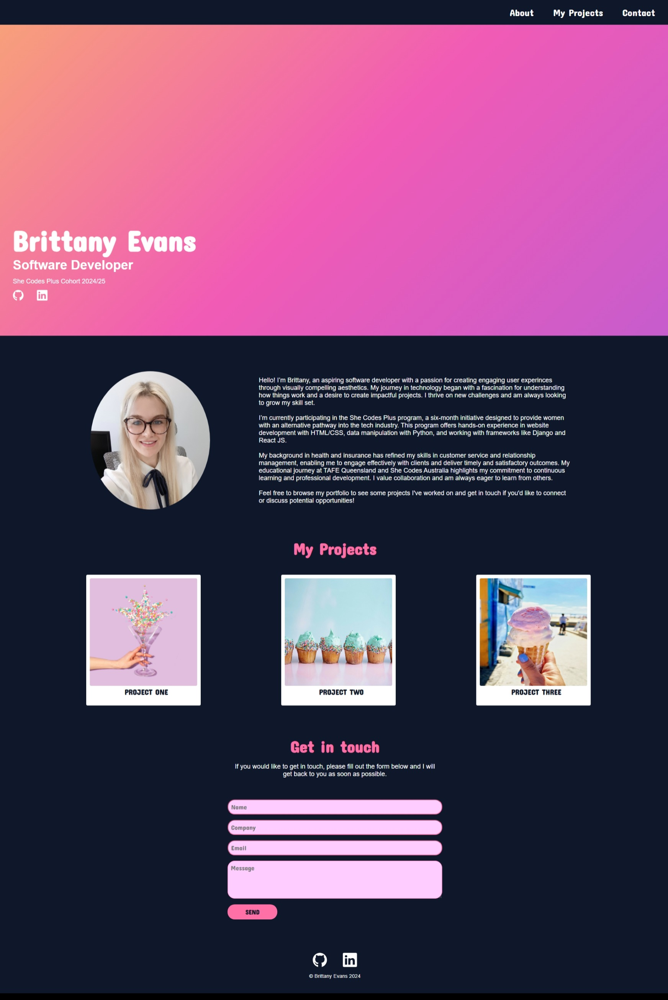
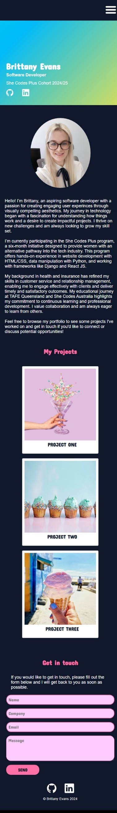

# Brittany Evans - Portfolio Task

​
[My portfolio site](https://britt-e.github.io/)
​

## Project Requirements

### Content

The website features a vibrant hero section, animated with a colourful linear gradient that creates a dynamic and engaging backdrop. Below, you'll find an "About Me" section, complete with a profile picture that adds a personal touch. The layout includes a "My Projects" section showcasing ongoing work, with links to a projects page for deeper insights. For ease of communication, there is a contact form positioned further down the page. Additionally, the site offers convenient links to external profiles, including GitHub and LinkedIn, to facilitate professional networking and further exploration. The design choices combine a vibrant yet minimalist aesthetic with user-centric functionality to create a seamless and informative experience.

- [x] At least one profile picture
- [x] Biography (at least 100 words)
- [x] Functional Contact Form
- [x] "Projects" section
- [x] Links to external sites, e.g. GitHub and LinkedIn. ​

### Technical

I created a portfolio website consisting of two web pages: a main landing page showcasing my projects and an additional page which will provide further detail on each project. The site employs responsive design principles, starting with a mobile-first approach and utilising media queries to ensure optimal display on larger screens. The entire project is version-controlled using Git and deployed on GitHub Pages. Semantic HTML is used throughout to enhance accessibility.

- [x] At least 2 web pages.
- [x] Version controlled with Git
- [x] Deployed on GitHub pages.
- [x] Implements responsive design principles.
- [x] Uses semantic HTML.

### Bonus (optional)

I implemented distinct styles for hover states across navigation links, project elements, and buttons to enhance user interaction. For mobile users, I incorporated a hamburger menu to ensure a streamlined and user-friendly navigation experience.

- [x] Different styles for active, hover and focus states.
- [ ] Include JavaScript to add some dynamic elements to your site. (Extra tricky!)
      ​

### Screenshots

#### Desktop min-width 768px

#### Mobile max-width 767px

#### My Projects Page Desktop

#### My Projects Page Mobile

#### Nav Hover

#### Projects Hover

#### Contact Hover

